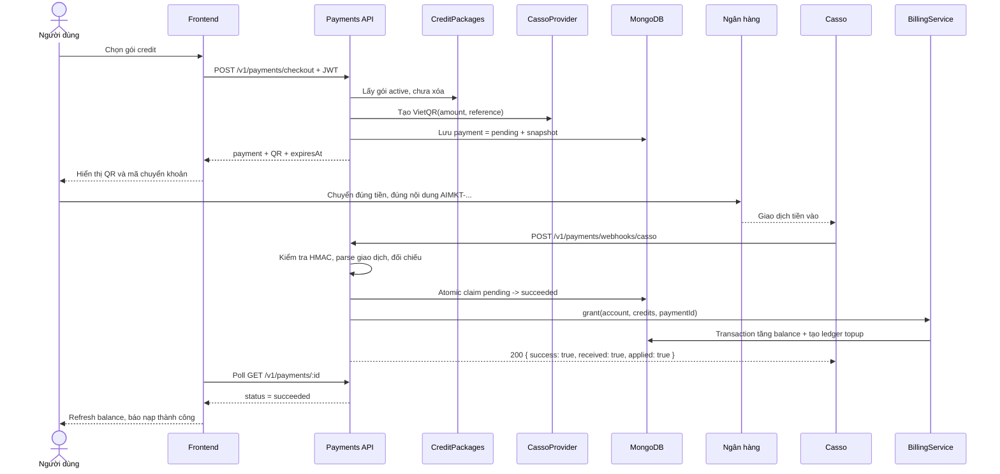
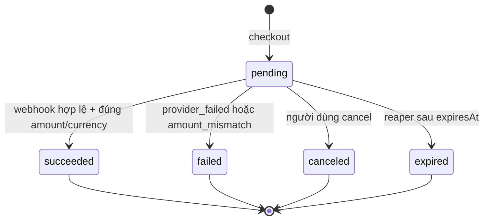

# Payment Top-up — tài liệu vận hành end-to-end

> Phạm vi: luồng mua credit package bằng QR, từ lúc client lấy danh sách gói đến khi tiền được
> xác nhận, credit được ghi vào balance/ledger, đơn hết hạn hoặc cần đối soát. Tài liệu phản ánh
> source hiện tại tại ngày 2026-07-21; không mô tả một thiết kế lý tưởng chưa được triển khai.

## 1. Tóm tắt luồng

Hệ thống hiện hỗ trợ hai payment provider:

- `casso`: luồng production cho VND. Backend tự tạo VietQR trỏ vào tài khoản ngân hàng của hệ
  thống; Casso theo dõi tài khoản và gửi Webhook V2 khi có tiền vào.
- `mock`: chỉ dùng local/dev/e2e. Provider tạo QR giả và endpoint `mock-confirm` dựng một webhook
  có chữ ký rồi đưa qua đúng luồng xử lý webhook thật.

Credit chỉ được cộng sau khi webhook hợp lệ xác nhận đúng số tiền và đúng đơn. Checkout không cộng
credit.



## 2. Thành phần và trách nhiệm

| Thành phần | Trách nhiệm |
| --- | --- |
| `CreditPackagesController/Service` | Trả các gói đang bán theo currency; bảo đảm checkout chỉ dùng gói `active`, chưa soft-delete. |
| `PaymentsController` | Checkout, history, status polling, cancel và mock-confirm; tất cả cần JWT. |
| `PaymentsWebhookController` | Nhận webhook không dùng JWT; xác thực bằng chữ ký của provider. |
| `PaymentsService` | Chọn provider, snapshot đơn, quản lý trạng thái, đối chiếu webhook và gọi cấp credit. |
| `CassoProvider` | Tạo payload VietQR/URL ảnh, xác minh HMAC-SHA512, trích mã đơn từ nội dung chuyển khoản. |
| `MockQrProvider` | Mô phỏng provider và webhook có HMAC cho dev/test. |
| `BillingService` | Trong Mongo transaction: tăng account balance và tạo ledger `topup`. |
| `ReaperService` | Mỗi phút đổi payment `pending` quá `expiresAt` thành `expired`. |

`PaymentsModule` hiện đăng ký đầy đủ các controller, vì vậy payment surface đang live khi app chạy.
Không còn feature gate bằng `PAYMENTS_ENABLED` trong source hiện tại.

## 3. Tiền điều kiện trước checkout

### 3.1 Credit package

Một gói được mua khi:

1. Document tồn tại.
2. `active = true`.
3. `deletedAt = null`.
4. Có một entry trong `prices` khớp currency được resolve.

Giá fiat và lượng credit được snapshot vào payment tại checkout. Sửa hoặc xóa mềm package sau đó
không làm thay đổi đơn đã tạo.

Hệ thống lưu balance, package credits và ledger theo đơn vị kế toán nội bộ USD bằng `Decimal128`.
API hiển thị theo quy ước cố định `1 USD nội bộ = 1000 credits`. Ví dụ package `10000` credits +
`500` bonus được lưu nội bộ là `10 + 0.5`, payment API trả `creditsToGrant = "10500"`, còn account
balance nội bộ tăng `10.5`.

### 3.2 Resolve currency

Thứ tự chọn currency:

1. `currency` trong body checkout, nếu thuộc `VND | USD`.
2. Header `cf-ipcountry`: `VN -> VND`, quốc gia khác -> `USD`.
3. Không có cả hai -> `VND`.

VND dùng config `PAYMENT_PROVIDER`. Currency khác dùng `PAYMENT_PROVIDER_<CCY>`, ví dụ
`PAYMENT_PROVIDER_USD`. Source hiện chỉ đăng ký `mock` và `casso`; chưa có adapter USD. Vì vậy một
request bị geo-resolve sang USD hiện có thể thấy package rỗng hoặc checkout trả
`payment_currency_unavailable`, tùy catalog/config.

### 3.3 Chọn provider an toàn

- Non-production: nếu không đặt `PAYMENT_PROVIDER`, VND tự fallback về `mock`.
- Production: không fallback; thiếu config trả `payment_provider_misconfigured`.
- Production chỉ đăng ký `casso`; `mock` không có trong provider registry và `mock-confirm` còn được
  hard-block trước khi đọc database.

## 4. Checkout chi tiết

### Request

```http
POST /api/v1/payments/checkout
Authorization: Bearer <jwt>
Content-Type: application/json

{
  "packageId": "<mongo-object-id>",
  "currency": "VND"
}
```

`currency` là optional. Sau khi xác thực JWT và DTO, backend thực hiện:

1. Lấy package đang active và chưa xóa.
2. Tìm đúng giá cho currency.
3. Resolve provider theo currency/config.
4. Tính `creditsToGrant = credits + bonusCredits` bằng decimal, không dùng floating point.
5. Sinh reference `AIMKT-` + 10 ký tự hex ngẫu nhiên viết hoa.
6. Tính `expiresAt = now + PAYMENT_QR_TTL_MS`; mặc định 15 phút.
7. Gọi provider tạo charge/QR.
8. Lưu payment `pending` với toàn bộ snapshot.
9. Trả payment view cho client.

Có unique index trên `reference` và `(provider, providerRef)`. Nếu save gặp duplicate key, checkout
sinh reference mới và thử tối đa 3 lần. Lỗi khác được trả ngay. Với Casso, `createCharge` chỉ dựng QR
tại backend, chưa gọi API tạo charge ở Casso và chưa có tiền dịch chuyển.

### Response rút gọn

```json
{
  "id": "...",
  "status": "pending",
  "provider": "casso",
  "packageId": "...",
  "amountFiat": "250000",
  "currency": "VND",
  "creditsToGrant": "10500",
  "reference": "AIMKT-12AB34CD56",
  "qr": {
    "data": "000201...",
    "imageUrl": "https://img.vietqr.io/image/..."
  },
  "expiresAt": "2026-07-21T...Z",
  "createdAt": "2026-07-21T...Z"
}
```

`qr` chỉ xuất hiện khi status còn `pending`. Client phải dùng các giá trị snapshot trong response,
không đọc lại package để suy ra giá/credit của payment đã tạo.

## 5. Người dùng thanh toán bằng Casso/VietQR

### 5.1 QR được tạo như thế nào

`CassoProvider` dựng payload EMVCo VietQR động gồm:

- bank BIN: `CASSO_BANK_BIN`;
- số tài khoản nhận: `CASSO_BANK_ACCOUNT_NO`;
- số tiền chính xác từ snapshot;
- nội dung chuyển khoản: payment `reference`;
- currency code VND `704` và CRC-16 hợp lệ.

`qr.imageUrl` trỏ tới `img.vietqr.io`, dùng `CASSO_QR_TEMPLATE` và có thể kèm tên tài khoản. FE có
thể render trực tiếp `qr.data` để không phụ thuộc ảnh hosted.

Casso chỉ chấp nhận VND nguyên. Currency khác hoặc amount có phần thập phân bị coi là provider
misconfiguration ngay lúc checkout.

### 5.2 Điều người dùng phải làm đúng

- Chuyển đúng `amountFiat`.
- Giữ mã `AIMKT-XXXXXXXXXX` trong nội dung chuyển khoản.
- Hoàn thành trước `expiresAt`.

QR hết hạn trong ứng dụng không ngăn ngân hàng nhận một lệnh chuyển muộn. Nếu tiền tới sau khi đơn
đã `expired`/`canceled`, hệ thống không tự cộng credit và cần đối soát thủ công.

## 6. Webhook Casso từ đầu đến cuối

### Endpoint và xác thực

```http
POST /api/v1/payments/webhooks/casso
X-Casso-Signature: t=<timestamp-ms>,v1=<hmac-sha512-hex>
Content-Type: application/json
```

Endpoint không dùng JWT. Chữ ký được tính trên:

```text
HMAC-SHA512(CASSO_WEBHOOK_TOKEN, timestamp + "." + JSON.stringify(sortKeysRecursive(body)))
```

Backend fail closed nếu thiếu checksum key, thiếu/sai format header hoặc HMAC không khớp, và trả
`401 invalid_webhook_signature`. Body webhook cố ý không đi qua DTO whitelist vì việc xóa field sẽ
làm sai dữ liệu đã ký.

Sau khi chữ ký hợp lệ, adapter:

1. Nhận `data` là một object hoặc array.
2. Chỉ giữ giao dịch tiền vào có `amount > 0`.
3. Tìm reference theo regex chấp nhận `AIMKT-XXXXXXXXXX`, `AIMKT XXXXXXXXXX` hoặc
   `AIMKTXXXXXXXXXX`, không phân biệt hoa thường.
4. Chuẩn hóa thành `AIMKT-XXXXXXXXXX`.
5. Tạo `providerRef = casso_<reference>` để khớp payment.
6. Dùng Casso `data.reference` (bank transaction id), fallback `data.id`, làm `eventId`.

Một delivery có chữ ký đúng nhưng không có giao dịch nhận diện được sẽ vẫn trả HTTP 200 với
`success: true`, `applied: false`, `reason: "no_events"` để Casso không retry vô ích.

### Đối chiếu và cấp credit

Với mỗi event, `PaymentsService` xử lý theo thứ tự:

1. Tìm payment bằng `(provider, providerRef)`.
2. Không tìm thấy -> ack `unmatched`, không cấp credit.
3. Đã `succeeded` -> ack `replay`, không cấp lại.
4. Không còn `pending` -> ack bằng status hiện tại; nếu event báo thành công thì ghi warning log để
   ops đối soát.
5. Event không thành công -> atomic update `pending -> failed`, reason `provider_failed`.
6. Currency sai, amount không parse được hoặc không bằng tuyệt đối snapshot -> atomic update
   `pending -> failed`, reason `amount_mismatch`.
7. Atomic claim bằng `findOneAndUpdate({_id, status: pending})` sang `succeeded`, đồng thời ghi
   `paidAt` và `providerEventId`.
8. Nếu mất race -> `raced`, không cấp credit.
9. Gọi `BillingService.grant` với type `topup` và `paymentId`.
10. Trong một Mongo transaction, billing tăng `accounts.balance` và tạo ledger row có
    `balanceAfter`.

Unique partial index trên `credit_transactions.paymentId` bảo đảm một payment có tối đa một ledger
top-up. Nếu grant gặp duplicate key, webhook được coi là replay. Nếu grant lỗi khác, service cố đưa
payment `succeeded -> pending`, xóa `paidAt/providerEventId`, rồi trả lỗi để provider retry.

Response thành công thông thường:

```json
{
  "success": true,
  "received": true,
  "applied": true
}
```

Batch response có thêm `results[]`; `applied` của batch là true nếu ít nhất một event được áp dụng.
Các event được xử lý tuần tự. Ngoài chữ ký sai, unknown provider có thể trả 400 và lỗi hạ tầng/grant
có thể trả 500; do đó mô tả “luôn 200” chỉ đúng với delivery hợp lệ đã được xử lý/ack an toàn.

## 7. Máy trạng thái payment



| Status | Ý nghĩa vận hành | Có QR trong API? | Có thể tự cấp credit tiếp? |
| --- | --- | --- | --- |
| `pending` | Đã tạo QR, chưa nhận webhook hợp lệ | Có | Có |
| `succeeded` | Đã claim thành công; bình thường đã có ledger/balance | Không | Không, replay được chặn |
| `failed` | Provider báo fail hoặc tiền/currency không khớp | Không | Không; cần xử lý thủ công nếu có tiền thật |
| `canceled` | Người dùng hủy khi đơn còn pending | Không | Không |
| `expired` | Reaper thấy quá hạn khi còn pending | Không | Không |

Không có transition tự động để retry một đơn terminal. Người dùng phải checkout đơn mới; mọi tiền
đến cho đơn terminal cần ops xử lý ngoài luồng tự động.

## 8. Polling, history và cancel phía client

Các endpoint sau yêu cầu JWT và giới hạn dữ liệu theo `accountId` trong token:

| Method | Endpoint | Dùng cho |
| --- | --- | --- |
| `GET` | `/api/v1/credit-packages` | Lấy gói theo currency/geo trước checkout. |
| `POST` | `/api/v1/payments/checkout` | Tạo payment pending và QR. |
| `GET` | `/api/v1/payments/:id` | Poll trạng thái. ID không thuộc account trả 403. |
| `GET` | `/api/v1/payments?page=1&limit=20` | History mới nhất trước; limit 1..100. |
| `POST` | `/api/v1/payments/:id/cancel` | Chỉ cancel payment đang pending. |
| `POST` | `/api/v1/payments/:id/mock-confirm` | Chỉ local/dev/e2e với payment provider `mock`. |

Client nên:

1. Poll detail khi status là `pending`; dừng ở mọi terminal status.
2. Dừng theo `expiresAt`, nhưng vẫn fetch lần cuối vì reaper chạy theo phút.
3. Khi `succeeded`, refresh balance/account rồi hiển thị thành công.
4. Nếu cancel trả 409, fetch lại detail vì webhook/reaper có thể vừa đổi trạng thái.
5. Không gọi webhook endpoint từ FE.

## 9. Expiry và scheduled worker

`ReaperService` chạy mỗi phút. Nó update hàng loạt mọi payment thỏa:

```text
status = pending AND expiresAt < now
```

sang `expired`. Vì lịch chạy mỗi phút, trạng thái API có thể còn pending tối đa xấp xỉ một chu kỳ sau
`expiresAt`. Một webhook thành công đến sau expiry được ack nhưng không grant; service ghi warning:

```text
Success webhook for non-pending payment <id> (status=expired) — needs reconciliation
```

## 10. Dữ liệu và các chốt idempotency

Payment lưu các nhóm dữ liệu sau:

- ownership: `accountId`, `packageId`;
- routing/matching: `provider`, `reference`, `providerRef`, `providerEventId`;
- snapshot: `amountFiat`, `currency`, `creditsToGrant`;
- lifecycle: `status`, `expiresAt`, `paidAt`, `failureReason`, timestamps;
- presentation: `qrData`, `qrImageUrl`.

Các index quan trọng:

- unique `(provider, providerRef)`;
- unique `reference`;
- `(accountId, createdAt desc)` cho history;
- `(status, expiresAt)` cho reaper;
- unique partial `credit_transactions.paymentId` cho exactly-once ledger.

Idempotency được bảo vệ theo ba lớp: payment đã succeeded trả `replay`; atomic
`pending -> succeeded` chỉ cho một worker thắng race; unique ledger `paymentId` chặn double grant ở
database.

## 11. Cấu hình triển khai

Production VND tối thiểu cần:

```dotenv
NODE_ENV=production
PAYMENT_PROVIDER=casso
PAYMENT_QR_TTL_MS=900000
CASSO_WEBHOOK_TOKEN=<checksum-key-webhook-v2>
CASSO_BANK_BIN=<napas-bank-bin>
CASSO_BANK_ACCOUNT_NO=<beneficiary-account>
CASSO_BANK_ACCOUNT_NAME=<beneficiary-name>
CASSO_QR_TEMPLATE=compact2
```

Trên Casso Flow, cấu hình Webhook V2 trỏ tới public HTTPS URL:

```text
https://<api-host>/api/v1/payments/webhooks/casso
```

Checksum key tại Casso phải trùng `CASSO_WEBHOOK_TOKEN`. MongoDB phải hỗ trợ transaction (replica
set/managed cluster), vì `BillingService.grant` dùng session transaction.

### Preflight trước khi mở traffic

1. Xác nhận `NODE_ENV=production`, `PAYMENT_PROVIDER=casso`; tuyệt đối không dùng mock.
2. Xác nhận bank BIN/account trong QR bằng một checkout thử không chuyển tiền.
3. Xác nhận Webhook V2 URL và checksum key.
4. Xác nhận Mongo replica set và indexes đã tạo; app gọi `createIndexes()` lúc bootstrap.
5. Chạy `pnpm smoke:casso` ở môi trường test/local. Script không gọi Casso và không chuyển tiền,
   nhưng kiểm tra full HTTP + Mongo transaction + signature + replay + mismatch.
6. Ở staging có tích hợp Casso thật, thực hiện một giao dịch giá trị kiểm thử và đối chiếu payment,
   account balance, một ledger row duy nhất.

### Drift cấu hình đang tồn tại

- `.env.example` đúng hướng production: `PAYMENT_PROVIDER=casso`.
- `deploy/env/prod.env.example` hiện vẫn có `PAYMENT_PROVIDER=mock` và `PAYMENTS_ENABLED=false`.
- `PAYMENTS_ENABLED` không còn được đọc trong source; comment trong `scripts/smoke-casso.ts` nói
  controller bị gate bởi biến này cũng đã lỗi thời.
- Do production provider registry không đăng ký mock, dùng nguyên `prod.env.example` sẽ làm checkout
  fail `unknown_payment_provider`, không tạo QR và không cấp credit. Cần sửa template/deployment
  config trước rollout thực tế.

## 12. Monitoring và đối soát

### Tín hiệu nên theo dõi

- HTTP count/rate theo status cho `/payments/checkout` và `/payments/webhooks/casso`.
- Webhook `401`: checksum key/header sai hoặc request giả mạo.
- Webhook 5xx: billing/Mongo lỗi; cần bảo đảm Casso retry.
- Confirm reason: `no_events`, `unmatched`, `amount_mismatch`, `provider_failed`, `raced`, `replay`,
  `expired`, `canceled`.
- Warning “Success webhook for non-pending payment”.
- Số payment pending quá `expiresAt`; bình thường reaper phải dọn trong khoảng một phút.
- Payment `succeeded` không có ledger `paymentId`, và ledger topup không có payment tương ứng.
- Độ lệch `account.balance` với tổng ledger; `BillingService.reconcileAccount()` đã có primitive kiểm
  tra cho từng account nhưng chưa có payment reconciliation job/admin API hoàn chỉnh.

### Runbook theo tình huống

| Tình huống | Kiểm tra | Xử lý an toàn |
| --- | --- | --- |
| Bad signature 401 | Webhook URL, checksum key, proxy có biến đổi JSON/header không | Sửa config/proxy; không bypass signature. Cho provider retry delivery gốc. |
| `no_events` | Giao dịch tiền vào có memo chứa AIMKT code không | Tìm bank transaction theo thời gian/amount; đối soát thủ công nếu khách quên memo. |
| `unmatched` | Reference trong memo, DB payment, providerRef | Không tự tạo grant; xác minh ownership/amount trước adjustment thủ công. |
| `amount_mismatch` | Amount/currency snapshot so với bank statement | Payment đã failed và không tự retry; refund hoặc adjustment theo quy trình tài chính. |
| Tiền đến sau expired/canceled | Warning log + bank statement + payment terminal | Không đổi status/grant trực tiếp tùy tiện; xác minh rồi refund hoặc tạo admin adjustment có reason/audit. |
| Webhook 5xx | Mongo availability, transaction support, account/ledger write | Khôi phục hạ tầng và retry webhook; kiểm tra cả payment và ledger trước khi replay. |
| `succeeded` nhưng thiếu ledger | Payment, account balance, ledger theo paymentId, log tại thời điểm webhook | Đây là bất thường nghiêm trọng; khóa thao tác tự động, đối soát rồi adjustment có audit. |
| Balance lệch ledger | `reconcileAccount(accountId)` | Điều tra trước; chỉ adjustment qua luồng admin có reason, không sửa Mongo trực tiếp. |

Không sửa trực tiếp `payments.status`, `accounts.balance` hoặc chèn ledger bằng Mongo shell trong vận
hành thường ngày; các thay đổi rời rạc có thể phá invariant và idempotency.

## 13. Giới hạn/rủi ro đã biết trong implementation hiện tại

Các điểm dưới đây là hành vi thực tế cần biết, không phải cam kết đã được xử lý:

1. **Payment claim và billing grant không nằm trong cùng transaction/outbox.** Service đổi payment
   sang `succeeded` trước, sau đó mới chạy transaction tăng balance + ledger. Lỗi được bắt thì có
   compensation về `pending`, nhưng process crash đúng giữa hai bước có thể để payment `succeeded`
   mà chưa cấp credit. Hiện chưa có reconciler tự sửa trường hợp này.
2. **Cancel chưa dùng conditional atomic update.** `findOwned()` rồi `payment.save()` có thể race với
   webhook claim; cần đặc biệt đối soát trường hợp terminal status không khớp ledger. Một thiết kế
   chặt hơn nên cancel bằng update có điều kiện `status: pending`.
3. **Webhook timestamp chưa có freshness window.** Timestamp tham gia HMAC nhưng backend không từ
   chối delivery quá cũ. Double credit vẫn bị các lớp idempotency chặn, nhưng request hợp lệ cũ có
   thể replay vô hạn.
4. **Không lưu inbound webhook/event thô.** `no_events`, `unmatched` và late payment chỉ hiện qua
   response/log; chưa có inbox/audit collection phục vụ tra soát lâu dài.
5. **Không có admin payment reconciliation workflow.** Late/underpaid/unmatched cần quy trình thủ
   công và audit qua adjustment/refund hiện có hoặc công cụ vận hành riêng.
6. **Không có idempotency key cho checkout.** Client retry checkout có thể tạo nhiều payment pending
   hợp lệ; đây không làm double charge tự động nhưng tạo nhiều QR/reference.
7. **Hosted QR image là dependency ngoài.** `img.vietqr.io` lỗi không làm hỏng `qr.data`; FE nên có
   khả năng tự render payload.
8. **Webhook controller nhận một trong hai header signature.** Nó ưu tiên `x-casso-signature`, rồi
   fallback `x-payment-signature`; provider adapter vẫn xác minh HMAC nhưng tên header không bị ràng
   buộc cứng theo provider.

Ưu tiên khắc phục trước khi tăng quy mô: (1) transactional outbox/inbox hoặc reconciliation job cho
payment-ledger; (2) atomic cancel; (3) lưu webhook events và dashboard/manual reconciliation; (4)
freshness window cho signature.

## 14. Kiểm thử và tiêu chí nghiệm thu

### Tự động hiện có

- Unit `payments.service.spec.ts`: unknown provider, chữ ký sai, unmatched, happy path, duplicate
  ledger, compensation khi grant lỗi, race, provider fail, amount mismatch, replay, production guard.
- E2E `payments.e2e-spec.ts`: package/checkout snapshot, mock confirm, exactly-once, ownership,
  cancel, expiry và late webhook.
- E2E `payments-casso.e2e-spec.ts`: VietQR thật, Casso V2 signature, replay, mismatch, no memo và
  batch delivery.
- Unit provider: `casso.provider.spec.ts`, `mock-qr.provider.spec.ts`.
- Smoke: `pnpm smoke:casso`.

### Lệnh xác minh

```bash
pnpm verify
pnpm test:e2e -- test/payments.e2e-spec.ts test/payments-casso.e2e-spec.ts
pnpm smoke:casso
```

Luồng đạt nghiệm thu cơ bản khi:

1. Checkout trả pending + QR đúng bank/amount/reference và chưa đổi balance.
2. Webhook hợp lệ đúng tiền đổi payment sang succeeded, tăng balance đúng một lần và tạo đúng một
   ledger topup có `paymentId`.
3. Replay không đổi balance/ledger.
4. Sai chữ ký trả 401 và không đổi DB.
5. Sai tiền chuyển payment failed và không grant.
6. Expired/canceled nhận tiền muộn không tự grant và tạo tín hiệu để đối soát.
7. Production không thể dùng mock-confirm hoặc fallback sang mock.

## 15. Điểm tham chiếu trong source

- HTTP surface: `src/modules/payments/payments.controller.ts`,
  `src/modules/payments/payments-webhook.controller.ts`.
- Orchestration/state/idempotency: `src/modules/payments/payments.service.ts`.
- Provider contract/adapters: `src/infra/payments/payment-provider.port.ts`,
  `src/infra/payments/casso.provider.ts`, `src/infra/payments/mock-qr.provider.ts`.
- Payment/package schema: `src/modules/payments/schemas/`.
- Credit grant/ledger: `src/modules/billing/billing.service.ts`,
  `src/modules/billing/schemas/credit-transaction.schema.ts`.
- Expiry: `src/workers/reaper.service.ts`.
- FE-specific contract: `docs/payment-flow-fe-contract.md`.
